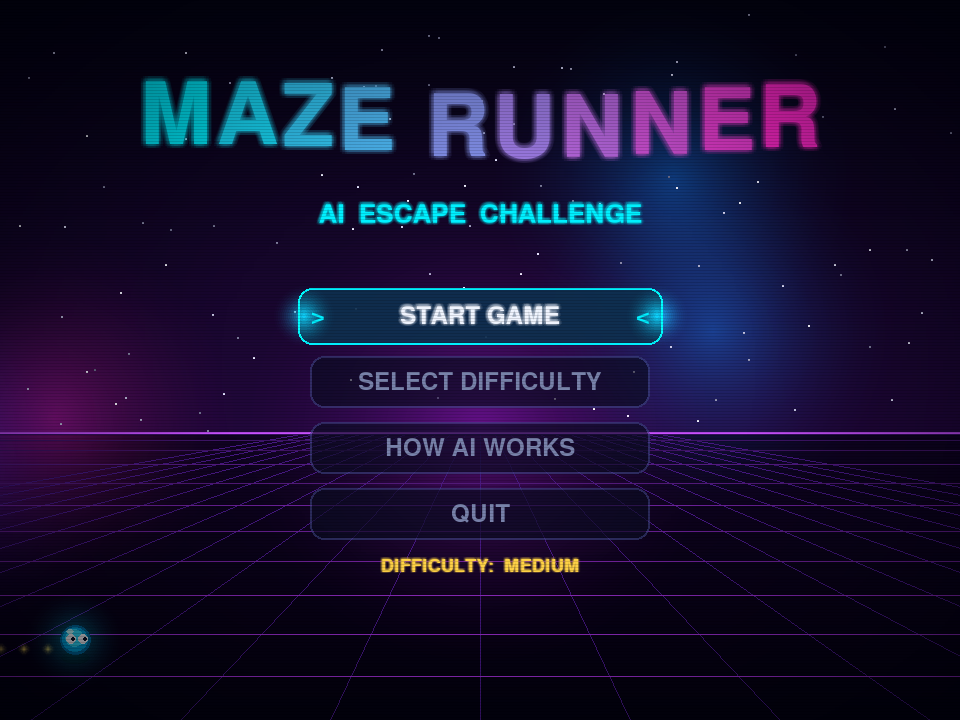
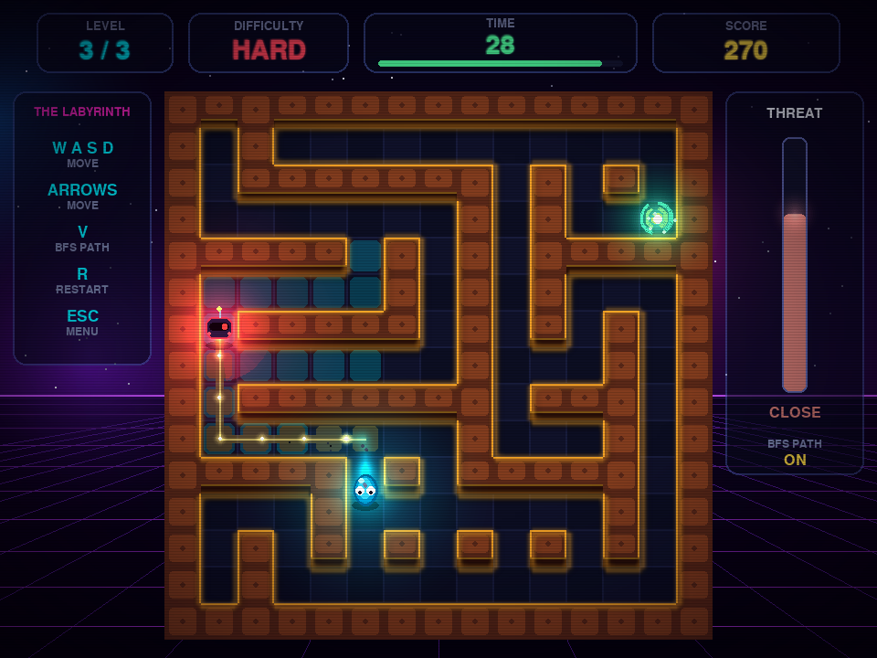
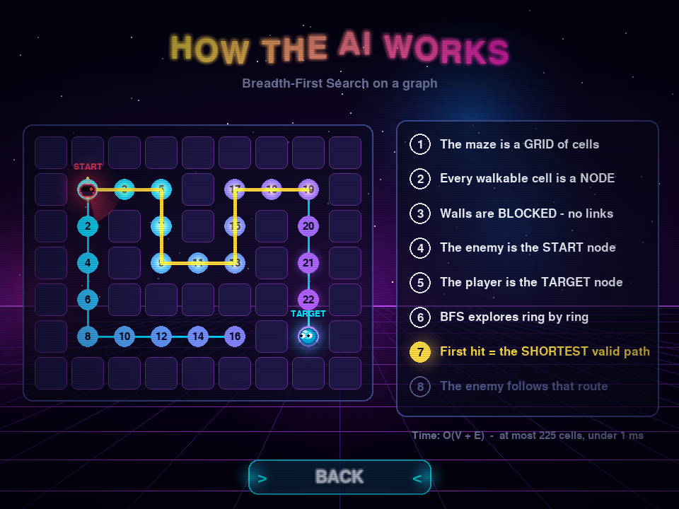
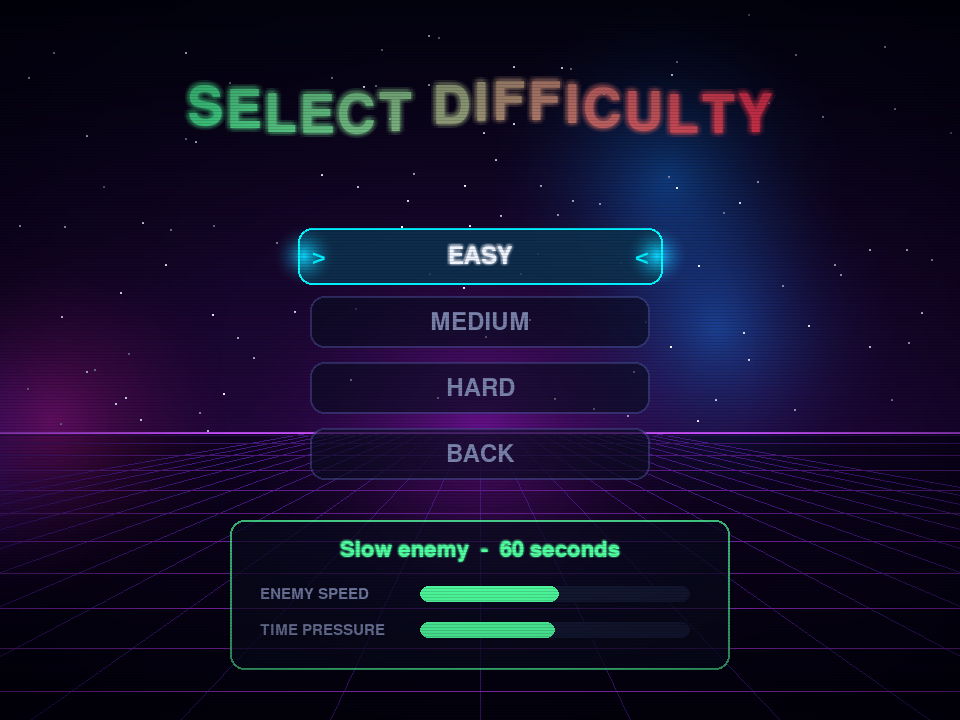
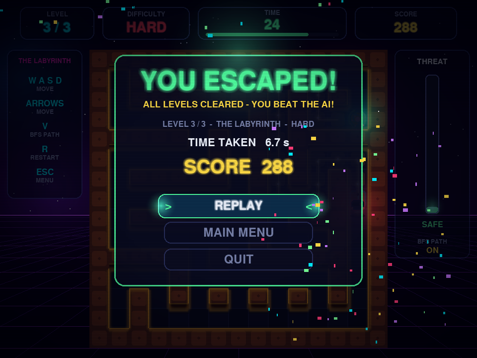
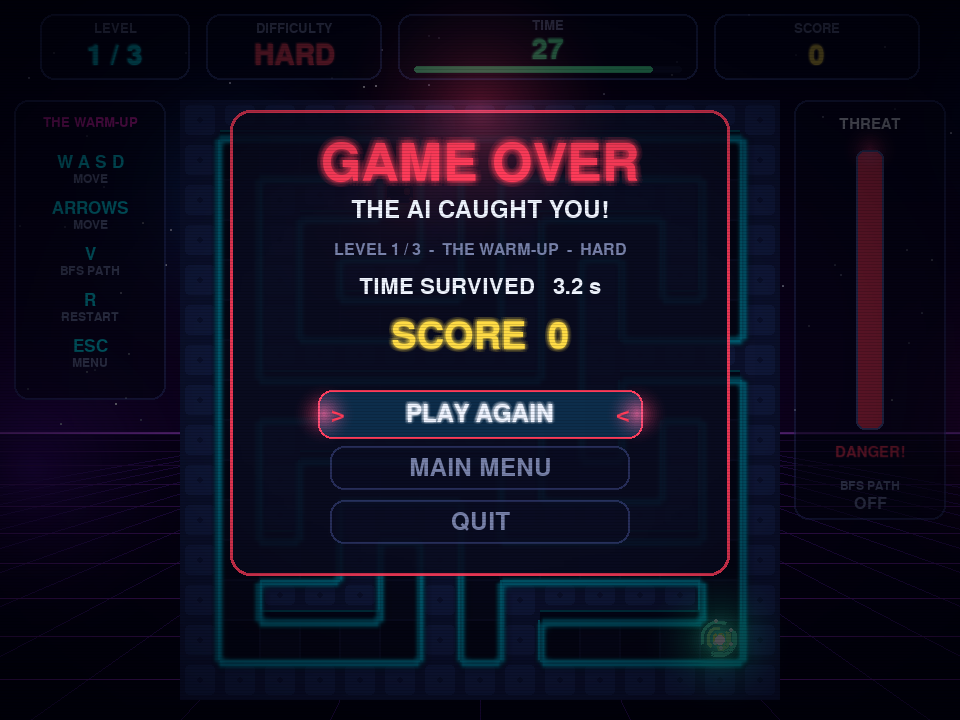

# MAZERUNNERAI - Maze Runner with an AI-Controlled Enemy

> A neon 2D maze-escape game in **Python + Pygame**. A robot hunts you through the maze using a **Breadth-First Search (BFS)** pathfinder written from scratch - and the game can *show* you the AI thinking.



## Table of contents
1. [Problem statement](#problem-statement) - 2. [Objective](#objective) - 3. [Features](#features) - 4. [Screenshots](#screenshots) - 5. [Install & run](#install--run) - 6. [Controls](#controls) - 7. [How the game works](#how-the-game-works) - 8. [BFS explained](#bfs-explained) - 9. [Enemy AI](#enemy-ai) - 10. [Code walkthrough](#code-walkthrough) - 11. [Difficulty](#difficulty) - 12. [Levels](#levels) - 13. [Scoring](#scoring) - 14. [Visual effects](#visual-effects) - 15. [Testing](#testing) - 16. [Customising](#customising) - 17. [Troubleshooting](#troubleshooting) - 18. [Future scope](#future-scope)

## Problem statement
Build a maze game where the player navigates to an exit while an enemy character chases them using a basic pathfinding algorithm (BFS or A*).

## Objective
Demonstrate how a classic graph algorithm powers a game AI, keep the code simple enough to explain line by line, and make the algorithm visible to the player.

## Features
- 3 predefined 15x15 mazes, every one verified solvable by automated tests
- Keyboard-controlled player (WASD / arrows) with smooth sliding movement, wall and boundary collision
- Enemy that recalculates a BFS path to the player and walks cell by cell - never through walls, never teleporting
- Win (reach the portal), lose (caught) and lose (timer hits zero) conditions
- EASY / MEDIUM / HARD difficulties, countdown timer, score, level indicator, threat meter
- **BFS visualiser** (`V`): flood-fill wave, highlighted route and energy dots flowing from enemy to player
- Animated **How AI Works** screen: nodes, edges, BFS visit order, shortest path
- Crazy visuals: neon walls with 2.5D depth, dynamic light pools, parallax synthwave background, particles, screen shake, danger vignette, confetti, swirling exit portal, CRT scanlines
- Synthesised sound effects (no audio files; silently disabled if there is no audio device)
- Only Python standard library + Pygame. No ML, no engines, no external pathfinding libraries.

## Screenshots
| Gameplay + BFS path | How AI works |
|---|---|
|  |  |

| Difficulty | Victory | Game over |
|---|---|---|
|  |  |  |

## Install & run
Requires **Python 3.10+**.
```bash
git clone https://github.com/priyadarshanlol/MAZERUNNERAI.git
cd MAZERUNNERAI
pip install -r requirements.txt
python main.py
```
Windows: double-click `run_game.bat` (installs Pygame and starts the game).

## Controls
| Key | Action |
|---|---|
| `W A S D` / Arrow keys | Move (hold to keep moving) |
| `V` | Show / hide the BFS visualiser |
| `R` | Restart the current level |
| `ESC` | Back / main menu (quits from the main menu) |
| Mouse / `Enter` | Menus |

## How the game works
```
MENU -> SELECT DIFFICULTY / HOW AI WORKS / START
                    |
                 PLAYING:  ready (3-2-1) -> play -> win | dead
                    |
          VICTORY (next level / replay)   or   GAME OVER (play again)
```
Every frame in `play`:
1. read keys, 2. move player (blocked by walls), 3. check exit, 4. enemy re-runs BFS every `recalc_ms`, 5. enemy steps along the path, 6. check catch, 7. tick the timer, 8. draw background -> maze -> lights -> BFS overlay -> exit -> enemy -> player -> particles -> HUD -> effects.

`dt` (seconds since last frame, capped at 0.05) drives every timer, so the game speed is independent of frame rate. Target is 60 FPS.

## BFS explained
The maze is a **graph**:
- **Node** = a walkable cell (`grid[r][c] == 0`)
- **Edge** = link between two neighbouring walkable cells (up, down, left, right)
- **Wall** = blocked node (`1`), never entered

BFS (`pathfinding.py`):
1. Put the start cell (enemy) in a **queue** and mark it **visited**.
2. Take the oldest cell out of the queue.
3. If it is the goal (player) - stop.
4. Otherwise add every unvisited, walkable neighbour to the queue, remember `parent[neighbour] = current`.
5. Repeat. If the queue empties, no path exists -> return `[]`.
6. At the goal, follow `parent` links back to the start and reverse the list = the path.

**Why BFS?** Every move costs the same (unweighted graph), and BFS explores in rings of equal distance, so the first time it reaches the goal is the **shortest** path.
**Why not DFS?** DFS finds *a* path, not the shortest one.
**Complexity:** O(V + E) time, O(V) space; V <= 225, E <= 4V, so it runs in well under 1 ms.
**Edge cases:** start == goal -> `[start]`; start or goal in a wall / outside grid -> `[]`; unreachable goal -> `[]`.

```python
path = find_path(maze.grid, enemy_cell, player_cell)   # [(r,c), (r,c), ...]
```

## Enemy AI
`enemy.py` keeps two timers:
- **recalc timer** (`recalc_ms`): runs BFS from the enemy's cell to the player's current cell, so the enemy reacts when you change direction.
- **step timer** (`enemy_step_ms`): moves exactly one cell along `path`, then the picture slides smoothly to the new cell (no teleporting).

If BFS returns `[]`, the enemy waits and tries again. The player moves 1 cell / 115 ms; the enemy is always slower, so you can outrun it but dead ends are dangerous. You are caught when the enemy is on your cell or closer than 0.55 cell on screen (this also catches the case where you swap cells head-on).

## Code walkthrough
| File | Role |
|---|---|
| `main.py` | `Game` class: loop, states, events, scoring, drawing of every screen |
| `settings.py` | Window size, tile size, speeds, difficulty table, colours |
| `levels.py` | The only source of mazes (text maps) + `load_level()` |
| `maze.py` | Grid queries (`is_walkable`), pre-rendered 2.5D walls + neon glow, animated exit portal |
| `player.py` | Grid movement, wall bumps, hop/squash animation, trail, `draw_blob()` |
| `enemy.py` | Enemy state, BFS calls, smooth stepping, BFS visualiser, `draw_bot()` |
| `pathfinding.py` | The single BFS implementation `find_path()` |
| `particles.py` | Additive glow lights, dust, bursts, confetti |
| `ui.py` | Text/panels, menus, HUD, animated background, vignette/scanlines, How AI screen |
| `sounds.py` | Generates sound effects with `array` + `math` |
| `test_*.py` | Unit and headless integration tests |

Level text format: `#` wall, `.` floor, `P` player, `M` enemy, `E` exit.

## Difficulty
| | Enemy speed | BFS recalculation | Time |
|---|---|---|---|
| EASY | 1 cell / 330 ms | every 450 ms | 60 s |
| MEDIUM | 1 cell / 240 ms | every 300 ms | 45 s |
| HARD | 1 cell / 170 ms | every 200 ms | 30 s |

## Levels
| # | Name | Shortest route | Notes |
|---|---|---|---|
| 1 | The Warm-Up | 28 steps | Long corridors, learn the controls |
| 2 | Neon Maze | 36 steps | More branches and loops |
| 3 | The Labyrinth | 58 steps | Long winding route, enemy close to the path |

Enemy start positions were chosen by simulation so that a perfect run can always escape on every difficulty.

## Scoring
`level score = whole seconds left x 10 + 100 completion bonus`. Scores accumulate across levels in one run. Replaying a level restores the score you had before it.

## Visual effects
Pre-rendered 2.5D walls and blurred neon halo, additive-blended light pools that follow player and enemy, rotating radar wedge, BFS flood wave and flowing energy dots, squash-and-stretch hero with afterimage trail, portal spiral, particle bursts, confetti rain, screen shake, red danger vignette, countdown zoom text, CRT scanlines.

## Testing
```bash
python -m unittest test_bfs test_levels test_game_loop -v
```
- `test_bfs.py` - straight path, around walls, no path, start == goal, walls/out-of-grid
- `test_levels.py` - size, solid border, markers, player->exit and enemy->player reachable
- `test_game_loop.py` - headless: a bot wins every level on every difficulty, standing still gets caught, timer expiry, wall blocking, no enemy teleport/wall clipping, all screens draw

## Customising
- Change speeds, time limits, colours in `settings.py`
- Add a level: append to `LEVELS` in `levels.py` (15x15 text map) and run `test_levels.py`
- Start with the BFS overlay off: `SHOW_BFS_PATH = False`

## Troubleshooting
- `No module named pygame` -> `pip install -r requirements.txt`
- No sound -> the game falls back to silent mode when no audio device is found
- Slow on an old laptop -> hide the BFS overlay with `V`

## Future scope
A* option, random maze generator, power-ups (freeze / speed), multiple enemies, level editor, leaderboard, gamepad support.

## Docs
`EXAMINER_QA.md` (15 viva questions) - `HACKATHON_PRESENTATION.md` (5 slides + demo script)

## Author
Priyadarshan V - B.Tech CSE (AI & Data Science), Reva University. Built for a 12-hour college hackathon.
